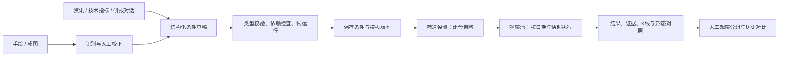
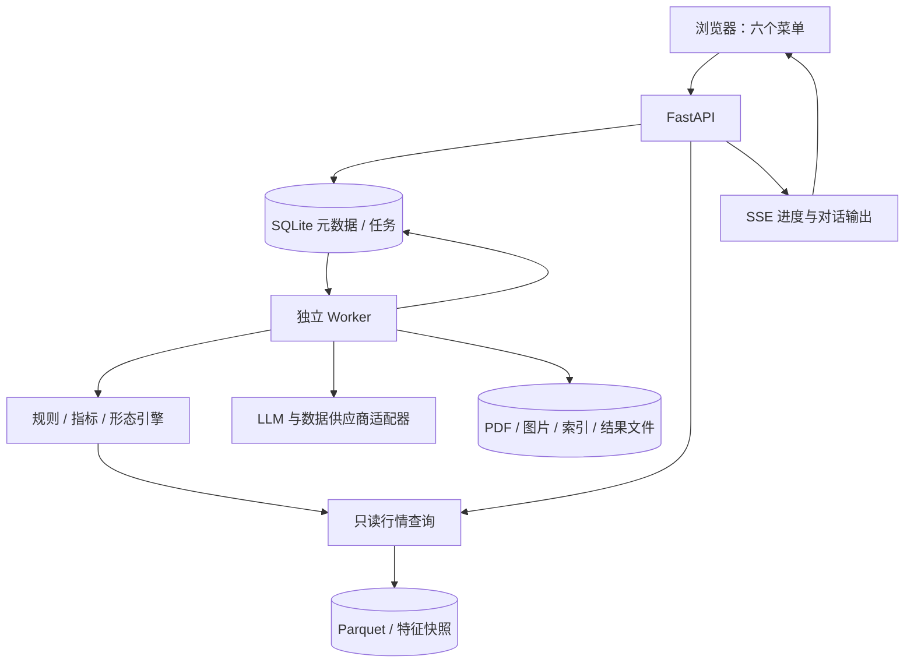

# LLM 投研工作平台实施计划

> 本文为2026-09-25首期设计及历史依据。2026-09-28确定的新一轮对话式筛选目标与执行顺序，以 [对话式股票筛选实施计划（GPT-6 Luna 执行版）](对话式股票筛选实施计划_Luna6.md) 为准；当前已经存在应用代码。数据保护、版本和证据要求延续，封闭规则及旧入口约束以新计划说明为准。

版本：1.0  
编制日期：2026-09-25  
目标工作目录：`D:\项目\LLM_research`  
文档用途：产品设计、技术实施、验收，以及新对话的执行依据。本文是实施计划，当前尚未创建平台应用。

## 1. 已确定的产品要求与默认决策

### 1.1 必须交付的六个一级菜单

按照用户最新补充，研报库独立进入一级菜单，最终顺序为：

1. 观察池
2. 资讯库
3. 技术指标库
4. 形态库
5. 研报库
6. 筛选设置

资讯库、技术指标库、研报库都支持“直接对话 → 生成筛选条件 → 查看解释与试运行 → 保存 → 再次编辑与复用”。形态库同时提供手绘输入、截图上传、识别校正和模板保存。筛选设置可以组合各库保存的条件，观察池可以加载组合策略并执行筛选。

### 1.2 不需要执行者再次询问的默认选择

| 事项 | 默认决策 | 原因 |
|---|---|---|
| 产品形态 | 本地运行的浏览器 Web 平台，优先适配桌面 | 适合 Windows 现有目录及多面板研究流程 |
| 首期行情范围 | A 股沪、深、北交易所，日线 | 已有本地行情；避免同时承担多市场行情、分钟线和实时行情接入 |
| 首期用户 | 单用户本地使用，业务实体保留 owner_id | 先交付完整研究流程；后续可以增加登录与团队权限 |
| 数据优先级 | 先接入本地 Parquet 和现有 PDF；资讯暂不连接外部数据 | 现有数据可直接作为实施基础 |
| 资讯供应商 | 预留 Tushare 适配器和能力检查，不假定账户已拥有资讯权限 | 资讯产品覆盖、积分、权限和限频需要按实际账户核验 |
| LLM 供应商 | 可配置适配器；分别配置文本模型、视觉模型、嵌入模型 | 能力差异需要显式处理，不能假定所有模型支持图片或结构化输出 |
| 筛选执行 | LLM 生成结构化条件，确定性引擎执行 | 保证条件可解释、可复用、可验证 |
| 保存单位 | 保存有版本的条件、形态模板与组合策略 | 避免编辑旧条件后历史结果悄然变化 |
| 运行频率 | 首期支持手动执行和本地每日收盘后计划执行 | 本机关闭时不保证任务运行；重启后按规则补跑 |
| UI 语言 | 中文；证券代码保留市场后缀 | 防止不同市场同代码混淆 |
| 交付边界 | 研究、筛选、观察、导出与历史复盘 | 首期无需券商账户和交易执行功能 |

界面设置放在顶栏的“系统设置/数据状态”入口中，不额外增加第七个一级菜单。

### 1.3 首期完整交付范围

首期必须形成完整可用流程，不能以六个静态页面或硬编码结果作为完成：

- 本地行情导入、数据检查、指标计算、证券检索、K 线查看。
- 现有 PDF 研报导入、解析、带页码检索、对话与条件保存。
- 资讯页可直接对话设计并保存条件，清楚展示“未接入”；正式资讯筛选在缺少数据时阻止执行。
- 技术指标库通过对话和表单创建、试算、保存并版本化条件。
- 手绘曲线/蜡烛图和截图输入均可生成可校正、可保存、可运行的形态模板。
- 策略组合支持 AND、OR、NOT、分组、硬过滤、排序、权重、TopN。
- 观察池支持加载策略、异步执行、查看命中原因、保存运行结果、对比和人工跟踪。
- 数据、规则、模型派生结果、运行日志可以追溯；支持备份、恢复和失败重试。

## 2. 现有工作区检查与实施影响

以下是 2026-09-25 的只读检查结果。没有读取或输出配置密钥，也没有修改原始数据。

| 项目 | 检查结果 | 实施影响 |
|---|---|---|
| 应用代码 | 顶层只有 `config.ini` 和 `data/`，未发现现成应用或 AGENTS.md | 按新项目搭建，不假定已有前后端框架 |
| 行情文件 | `data/stock_data/stock_daily.parquet`，624,400,120 字节，约 624.4 MB | 采用列式查询，避免每次请求把全文件读入 pandas |
| 行情规模 | 16,933,080 行，5,562 个唯一 stock_code | 以约 6,000 只证券作为首期性能基线 |
| 市场后缀 | SH 2,318、SZ 2,901、BJ 343 | 这是文件中的代码数量，不代表某日实际上市或可交易数量 |
| 行情日期 | Parquet 元数据范围：1990-12-19 至 2026-09-14 | 当前行情明显早于文档日期，必须展示行情水位 |
| 最近一日原始记录 | 2026-09-14 有 5,550 行 | 尚未验证主键重复、停牌或市场覆盖，不将其宣称为完整覆盖率 |
| 行情字段 | trade_date、stock_code、open、high、low、close、volume、amount | 缺少复权因子、证券名称、行业、ST 历史、上市退市状态等字段 |
| 研报目录 | `data/research_report/`，12 份 PDF | 可以作为导入和检索的实际验收样本 |
| 研报范围 | 文件名涉及 A 股、港股、韩国证券；文件名日期集中在 2026-09-21 至 09-23 | 文件名仅用于初始元数据候选；以正文和可追溯来源确认日期、代码 |
| 配置结构 | 存在 app、model_providers、secrets、security、tushare 等节 | 做兼容读取层；不直接把现有文件当作已验证的平台配置 |
| 本地 Python | 发现 Python 3.12，已有 pyarrow、pandas、pypdf；未发现 duckdb | 项目仍应建立独立虚拟环境并锁定依赖，不依赖全局包状态 |

**当前最需要处理的时间错位：**不能把 2026-09-21 之后的研报用于 2026-09-14 的“截至当日筛选”。默认严格按筛选时点过滤证据。研报库可以独立研究较新研报，但跨库组合时必须提示行情过期并明确各数据水位；不得自动将后来的研报回填到过去。

**实施前仍需核验：**价格是否复权及复权口径、成交量与成交额单位、主键唯一性、异常 OHLC、缺失值、交易日历、证券基础资料、PDF 是否包含可提取文本、现有模型配置是否有效。本文未对这些事项作事实保证。

## 3. 用户任务与页面设计

### 3.1 观察池：策略执行与持续跟踪

布局建议：顶部运行控制区，中部结果表格，右侧股票详情抽屉，底部任务状态或历史运行记录。

顶部必须有：策略及版本选择、证券范围、筛选日期、数据水位、运行按钮、运行状态、导出入口。切换策略版本不自动覆盖当前人工观察分组。

结果表格至少显示：代码、名称（缺失时显示代码）、市场、截止价、涨跌幅（有前值时）、综合分、形态相似度、命中条件摘要、证据时间、数据状态。支持排序、列显隐、搜索、多选加入观察分组。

股票详情包括：日 K 线、MA/成交量等叠加、条件逐项通过/失败/未知、指标实际值与阈值、研报/资讯引用、形态匹配区间和曲线叠加、人工标签和笔记。

“策略运行结果”和“人工观察池成员”分开保存：运行结果是不可变快照；人工观察池长期保留，可以分组、置顶、移除、记录添加原因。支持“本次新增命中、连续命中、本次退出”，比较时使用同一策略版本与明确的运行日期。

空态与异常必须区分：尚未运行、合法零命中、输入数据不可用、任务失败、任务取消、部分评估完成。零命中不能代替错误状态。

### 3.2 资讯库：未接入状态下仍可设计条件

采用三个区域：“资讯列表 / 条件资产”“对话工作区”“条件草稿与证据预览”。资讯类型可预留快讯、新闻、公告，实际可用类型由供应商能力表决定。

用户可以直接说：“找过去 5 个交易日公告新增订单、明确提到数据中心、金额超过 1 亿元的公司。”系统转换为有时间范围、主体关联、事件类型、金额单位和证据要求的条件。

当前不接入外部资讯时：

- 显示“资讯尚未接入”及供应商设置入口，不展示伪装成真实数据的资讯。
- 允许对话、编辑、校验规则结构和保存；状态为“已保存，待数据源启用”。
- 试运行只允许显式切换到独立演示数据集，界面持续标记“演示”。演示结果不进入真实观察池。
- 含资讯硬过滤条件的正式策略进入 `blocked_dependency` 状态，并列出缺少的资讯能力。
- 系统设置可以保存 Tushare 接入配置、检查权限和展示错误；正式同步留待接入阶段实施。

### 3.3 技术指标库：对话、公式解释与数值预览

左侧为已保存条件及分类，中间为对话，右侧为条件编辑器和指标曲线。分类建议：趋势、动量、波动、量价、突破、复合条件、自定义模板。

首批指标：SMA/MA、EMA、MACD、RSI、KDJ、BOLL、ATR、滚动最高/最低、成交量均线、区间涨跌幅、量比型自定义窗口比值。这里的“窗口量比”与行情软件中的实时量比应区分命名。

首批操作：大于/小于/区间、向上/向下穿越、过去 N 根中至少 M 根成立、连续成立 N 根、距离某均线百分比、突破前 N 根最高价、不含当根的前值引用。

例：“收盘价在 20 日均线上方，5 日均线今天上穿 20 日均线，成交量达到过去 20 日均量的 1.5 倍。”生成后要解释是否包含今天的量；默认“过去 20 日均量”使用不含当根的 20 根交易 bar，并在条件卡片上显示。

用户能切换证券和日期做数值试算，看到所需历史长度、公式、实际值、阈值及缺失原因。保存的是结构化计算图；首期不支持任意 Python、SQL 或用户代码执行。

### 3.4 形态库：手绘和截图同等可用

入口有“手绘创建”“上传截图”“从行情区间创建”“已保存模板”。其中前两项为强制验收项，从行情创建有助于快速生成高质量模板。

手绘支持两种模式：

- **走势曲线模式：**自由画线或编辑控制点，表达价格路径。只保存价格走势特征，不能凭一条线虚构开高低收。
- **蜡烛图模式：**逐根增删 K 线，拖动开盘、收盘、最高、最低，校验 high ≥ max(open, close)、low ≤ min(open, close)。支持批量调整和撤销/重做。

截图流程：上传 → 裁剪主图 → 识别图表类型 → 提取候选走势/蜡烛特征 → 展示不确定位置 → 用户校正 → 配置周期/长度/容差 → 预览匹配 → 保存版本。

支持模板名称、标签、说明、形态周期、目标 bar 数、时间伸缩容差、幅度约束、相似度阈值及匹配模式。提供原图/手绘、提取结果与候选行情的并排展示。

无法可靠识别时允许重裁剪或转为手工描点，并显示失败原因。需要清楚区分“自动识别成功”和“人工补录完成”；不能只给图片写一段描述便宣称实现了形态筛选。

### 3.5 研报库：独立一级菜单

支持目录批量导入和文件上传、解析任务列表、研报列表、全文/PDF 阅读、按页检索、对话和条件资产。

基础元数据：标题、机构、作者（能确认时）、发布日期、首次可用时间、语言、市场、关联证券、报告类型、原文文件、文件哈希、解析质量和解析版本。

对话可以引用单篇、选中的多篇或整个已索引库。例如：“最近 30 个自然日，至少两家不同机构明确提到订单增长，且给出原文依据。”系统生成事件或文档级条件，并展示机构去重和时间口径。

报告中的目标价、评级、盈利预测、订单、产能、客户验证等可以提取成结构化事实。必须保留页码、原文片段、数值单位、所指期间和事实类别；“机构预测”和“已经实现的业绩”不能混为一类。

港股、韩国等报告可以正常检索和对话，但只有成功绑定首期 A 股证券的报告才参与 A 股筛选。行业研报不能无依据映射给全行业股票；允许用户显式确认关联范围并记录操作。

### 3.6 筛选设置：组合策略编辑器

左侧展示按库分类的已保存条件；中部为条件树；右侧展示策略参数、数据依赖、文字解释和试运行统计。拖拽是便利操作，同时提供“添加条件/分组”按钮和键盘操作。

支持：

- AND / OR / NOT，以及任意合法嵌套；首期 UI 限制深度为 5 层防止误操作。
- 条件参数覆写，例如复用同一“均线突破”模板，分别设置 20 日和 60 日窗口。
- 硬过滤与评分项分区；通过硬过滤后再计算排序。
- 每个评分项的权重、方向、归一化方式；权重总和由系统明确展示。
- 证券范围、筛选时点、行情复权口径、最小历史长度、数据缺失处理、TopN。
- 试运行、保存草稿、发布版本、复制、归档、查看历史、对比版本。

保存后状态为 `draft` 或 `published`。观察池默认加载已发布版本；试运行可以使用草稿快照。引用条件有新版本时显示“可升级”，用户逐项选择升级，旧策略不自动改变。

## 4. 统一业务对象与主流程

### 4.1 对象定义

| 对象 | 定义 | 必须保存的关键内容 |
|---|---|---|
| 原始数据源 | 行情、资讯、研报原件 | 来源、文件/接口、时间、哈希、访问能力 |
| 派生数据 | 指标、文档块、事件、形态特征 | 依赖快照、算法/模型版本、生成时间 |
| 条件资产 Filter | 可重复使用的筛选逻辑 | 所属库、名字、参数、版本、规则 AST |
| 形态资产 Pattern | 来自手绘、截图或行情的模板 | 原件、校正记录、标准特征、匹配参数、版本 |
| 组合策略 Strategy | 条件组合与排序设置 | 固定条件版本、组合树、评分配置、股票范围 |
| 运行 Run | 特定日期及数据快照上的一次执行 | 策略版本、依赖版本、覆盖率、结果、解释 |
| 观察分组 Watchlist | 人工持续跟踪的集合 | 成员、添加来源、时间、标签、笔记 |
| 对话会话 Chat | 生成和迭代资产的上下文 | 消息、引用、建议补丁、草稿版本、调用计量 |

删除采用归档/软删除；已被策略或历史运行引用的版本不得直接物理删除。编辑已保存资产生成新版本，名称可以修改，历史正文保持不可变。

### 4.2 主流程图



核心区分：对话用于制定和解释规则；规则执行引擎决定证券是否命中。自然语言说明、LLM 原始输出和可执行规则分别保存。

## 5. 筛选语义：先定义正确性，再实现界面

### 5.1 证券范围与时间口径

- `market_scope` 首期为 A 股，保留 SH/SZ/BJ 后缀，不只使用六码代码。
- `as_of` 使用带时区时间；日线筛选默认对应交易所当日收盘后的数据截止点。
- `evaluation_date` 必须是有效交易日，非交易日选择上一交易日时要明显提示。
- 日线指标的“N 日”默认为 N 根有效交易 bar；资讯/研报“最近 N 天”默认自然日，均显示在界面并可修改。
- 区间使用 `(window_start, as_of]`，不能把截止日之后的记录带入。
- 使用交易所本地时区确定交易日，数据库时间戳统一保存 UTC，同时记录源时区；业务日期单独使用 date 类型。

严格历史复现中，证据必须同时满足 `published_at <= as_of` 和 `first_available_at <= as_of`。首次可用时间有可靠来源记录时使用该记录，否则默认导入时间，不能凭文件名倒推首次可用时间。

可另设“按发布日期回看”的探索模式，明确标记其无法证明当时可获得，不用于宣称严格历史结果。当前新导入的旧报告，在严格历史模式下可能没有可用结果，这是符合语义的行为。

证券范围也有版本：没有完整的上市/退市、ST 和指数成分历史时，只能声明“当前数据集覆盖范围”，不能宣称无幸存者偏差的历史全市场。数据快照能保证计算可重复，但不能证明所有历史修订值都在当时可见；严格历史验收必须单独检查数据的历史可得性。

### 5.2 价格、复权和单位

原始 OHLC 与复权因子分开存储。当前文件的价格口径未确认前，标记 `source_native_unknown`；允许查看原始曲线、保存条件和发布策略定义，但默认阻止依赖该数据的正式价格形态/跨期技术筛选运行，只有显式启用“探索性原始口径”时才允许试运行并持续展示标记。资产是否已发布与当前环境是否可执行分别展示。

复权实现必须有清楚的公式、基准日期和因子版本；历史运行只能使用当时可知的公司行动及固定快照。不能以今天动态前复权的全部数据冒充过去真实可得的价格序列。

成交量与成交额单位也需核验。单位不明时可以使用同口径无量纲比值，但不能运行“成交额 > 1 亿元”等绝对阈值条件。换算规则写入数据集元数据，禁止依靠经验猜测。

### 5.3 缺失、未知与错误

规则计算采用三值逻辑：`true / false / unknown`。停牌、历史长度不足、证券未关联、文档尚未索引都应提供明确原因，不等同于 false。

| 表达式 | 结果 |
|---|---|
| false AND unknown | false |
| true AND unknown | unknown |
| true OR unknown | true |
| false OR unknown | unknown |
| NOT unknown | unknown |

正式结果只收录最终为 true 的证券，并提供 false、unknown、排除和失败的分别统计。默认策略在执行前要求全部启用分支的数据依赖可用；不因为某个 OR 分支可能成立就偷偷跳过尚未接入的资讯库。

供应商级断连、规则编译失败、算法异常属于运行错误或依赖阻断；证券级少量缺失属于 unknown。可选“允许部分覆盖”必须显式配置并将整次运行标记为 `partial`，导出和对比也保留这一标记。

### 5.4 条件、排序和 TopN

硬过滤决定候选集，评分只对候选集排序。不得将“分数较高”自动解释成“满足所有条件”。

评分 v1 支持固定范围的线性缩放和同批候选的百分位排名。百分位依赖当次候选范围，需要存入运行配置；常量列默认 0.5，不能除以零。首期避免每次运行静默使用不同的 min-max 上下界。

总分默认：`100 × Σ(weight_i × normalized_score_i) / Σ(weight_i)`。权重必须非负且至少一项为正。若没有评分项，按配置的指标排序或代码排序，不显示虚构的综合分。

评分缺失默认使该证券进入未完成评分集合，不参加正式 TopN；可由策略显式指定固定缺失分，并在解释中披露。最终相同分按证券代码稳定排序。TopN 在完整候选评估之后截取，不能先随意截取股票再声称全市场 TopN。

### 5.5 资讯与研报的文档语义

默认同一组事件属性须由同一个事件/文档证据单元满足。例如“AI 订单且金额 > 1 亿”不能将一篇报告中的 AI 与另一篇报告中的非 AI 订单金额拼成结论。

跨文档累计、不同机构计数、多个事件并集必须使用明确聚合节点。新闻转载按来源链或内容哈希去重；同机构同主题研报不重复计为多家机构。

“盈利预测上调”必须有同机构、同证券、同预测期的前后值或明确原文陈述；只有一份当前预测值时不能推断上调。“客户导入”需区分送样、验证、试产、量产等阶段，事实不充分时为 unknown。

## 6. 条件协议与版本规范

### 6.1 规则表达方式

采用版本化 JSON DSL（内部数据协议），后端使用 Pydantic 校验，前端根据 JSON Schema 生成编辑器类型。用户界面主要显示中文条件，不要求用户编辑 JSON。

条件资产通用字段：

| 字段 | 含义 |
|---|---|
| id / version / schema_version | 稳定资产 ID、不可变业务版本、协议版本 |
| kind | technical / news / report / pattern |
| name / description / tags | 用户管理与检索信息 |
| parameters | 带类型、单位、默认值、范围的参数定义 |
| expression | 有类型的 AST，不是字符串代码 |
| requirements | 字段、窗口长度、数据源、模型派生能力、价格口径 |
| explanation | 面向用户的解释及默认假设 |
| provenance | 来源会话、创建方式、模型/提示词/算法版本 |
| status | draft / validated / archived；可执行性另外按环境计算 |

技术表达式 v1 的白名单节点：`field`、`constant`、`parameter`、`indicator`、`shift`、`rolling`、`arithmetic`、`compare`、`cross`、`count_true`、`all`、`any`、`not`。运算限制窗口、嵌套、除零、类型和单位。

证券级组合树节点为：`filter_ref`、`all`、`any`、`not`。`filter_ref` 必须固定 `filter_id + version`；参数覆写也要通过原定义的类型与范围验证。

新闻/研报条件表达式使用 `evidence_query`：文档类型、主体绑定、时间窗口、事件属性、原文包含/排除、证据强度、聚合方式、最小机构数等。语义分类由有版本的提取任务事先形成证据事实，不在每只股票布尔判断时自由生成结论。

形态条件使用 `pattern_match`：`pattern_id + version`、输入价格口径、匹配算法/版本、窗口长度、阈值、约束、是否必须匹配至当根。

### 6.2 技术条件示例

以下示例要求今天 MA5 向上穿越 MA20；SMA 的 warmup 使用完整窗口，cross 比较今天与上一根，遇到缺失返回 unknown。

```json
{
  "id": "filter_ma_cross",
  "version": 1,
  "schema_version": "1.0",
  "kind": "technical",
  "name": "MA5 上穿 MA20",
  "parameters": {
    "fast": {"type": "integer", "default": 5, "min": 2, "max": 120},
    "slow": {"type": "integer", "default": 20, "min": 3, "max": 250}
  },
  "expression": {
    "op": "cross",
    "direction": "up",
    "left": {"op": "indicator", "name": "sma", "input": {"op": "field", "name": "close"}, "window": {"op": "parameter", "name": "fast"}},
    "right": {"op": "indicator", "name": "sma", "input": {"op": "field", "name": "close"}, "window": {"op": "parameter", "name": "slow"}}
  },
  "requirements": {
    "dataset": "daily_bars",
    "fields": ["close"],
    "price_basis": "declared_consistent",
    "lookback": "derived_from_expression"
  },
  "status": "validated"
}
```

指标表达式中的参数最终须解析为值后参与规则哈希。warmup 由编译器递归计算，不完全相信 LLM 给出的天数；技术指标公式及初始化规则也进入编译器版本。

### 6.3 组合策略示例

```json
{
  "id": "strategy_trend_evidence",
  "version": 1,
  "schema_version": "1.0",
  "name": "趋势确认与研究证据",
  "universe": {"markets": ["SH", "SZ", "BJ"], "min_history_bars": 120},
  "clock": {"mode": "strict_as_of", "timezone": "Asia/Shanghai"},
  "hard_filter": {
    "op": "all",
    "children": [
      {"op": "filter_ref", "filter_id": "filter_ma_cross", "version": 1, "params": {"fast": 5, "slow": 20}},
      {"op": "any", "children": [
        {"op": "filter_ref", "filter_id": "filter_report_orders", "version": 1, "params": {"lookback_calendar_days": 30}},
        {"op": "filter_ref", "filter_id": "filter_platform_breakout", "version": 1, "params": {}}
      ]}
    ]
  },
  "ranking": {
    "items": [{"source": {"kind": "field", "name": "amount"}, "normalize": "percentile", "direction": "higher", "weight": 1}],
    "missing": "exclude_from_rank",
    "tie_breaker": "stock_code_ascending",
    "top_n": 30
  },
  "dependency_policy": "require_all_enabled",
  "unknown_policy": "exclude_and_report",
  "status": "published"
}
```

示例中的 ID 是协议说明用占位资产，不是当前已存在的策略。实施验收时必须实际创建三个被引用条件后再执行，缺少引用时校验应拒绝。`universe.min_history_bars` 不是隐式排除 ST 的替代品；ST、行业等过滤只有基础资料具备时才开放。

### 6.4 执行解释与冻结

每个结果节点至少保存：节点 ID、状态、实际值、阈值、数据窗口、缺失原因、证据引用、计算版本。运行冻结策略展开后的条件树及全部版本，不只保存当前资产的 ID。

运行清单同时记录：数据快照、行情价格口径、资讯水位、报告/文档块版本、语义提取版本、形态特征版本、指标引擎版本、规则编译器版本、参数、证券范围、排序规则和随机种子（如用到）。

“可复现”指使用冻结的派生数据与规则能重复计算相同结果；不承诺重新调用远程 LLM 会逐字生成相同输出。

## 7. LLM 对话与条件编译流程

### 7.1 三个知识库统一使用的处理链

1. 装载会话所在库、用户选中的文档/证券/日期、指标与字段白名单。
2. 识别用户是在问答、制定条件、修改草稿还是请求试运行。
3. 检索相关文档或能力说明，向模型提供有限且有来源的上下文。
4. 模型返回结构化意图、AST 候选、参数、解释、默认假设及缺少的信息。
5. 后端做 JSON Schema、类型/单位、语义、窗口长度、数据能力和引用版本校验。
6. 校验失败允许最多两次带具体错误的修复；仍失败则保留草稿并显示可修改原因。
7. 前端展示“中文条件摘要 + 可编辑表单 + 数据依赖 + 本次改动”。
8. 用户触发试运行；后台执行引擎产生真实数值与证据。对无数据的资讯只做结构校验。
9. 用户点击保存后创建资产版本；发布组合策略后可在观察池选择。

涉及日期、单位、不同机构计数、量产/送样等会改变结果的歧义，要在界面展示待确认项。能合理确定的默认值直接填入并突出展示，不无限追问。

### 7.2 编辑和会话保存

修改已有条件时模型生成针对草稿的结构化补丁，并带 `base_revision`。后端检测并发编辑冲突，不能让晚返回的模型输出覆盖更新后的草稿。

保存资产不要求保留所有聊天消息，但必须保留生成上下文摘要、已确认默认值及相关引用。会话重开后能够载入之前草稿继续编辑。流式回答与资产保存事务分离，中断回答不生成半条有效规则。

### 7.3 工具边界与模型能力

模型可使用有限工具：查询字段/指标目录、检索文档、获取小范围行情摘要、校验规则、申请有范围上限的试运行。模型不能任意访问磁盘、运行代码、执行原始 SQL、读取密钥或擅自修改已发布策略。

研报、资讯和截图中的文字都是待分析数据；即使其中出现“忽略规则”“上传密钥”等文本，也不能提升为系统指令。文档检索内容和工具调用权限分开处理。

统一模型适配器暴露文本生成、结构化生成、图片理解、嵌入等独立能力。能力不足时给出明确提示，例如视觉模型未配置时仍保留本地图像提取与人工编辑，但不能标记为视觉模型识别成功。

记录调用时长、用量、估算成本、模型和提示词版本；每次对话、导入批次及筛选任务均有预算和超时。重试需要退避，对可能已产生费用的请求展示调用记录；缓存键包含输入哈希、模型、提示词、schema 和参数。

### 7.4 证据提取和覆盖范围

报告或资讯先按证券、日期、文档类型等结构条件缩小范围，再运行检索和事实提取。针对新研究主题的动态提取应形成有版本的提取任务，并向用户显示已处理文档数/总文档数。

只检索前 K 篇可用于回答研究问题；若策略声称统计“全部相关研报”，则必须完成规定范围的提取或标记部分覆盖。不能把检索未召回解释成“公司不存在该事件”。

## 8. 技术指标计算规范

统一以证券代码、交易日排序后的有效 bar 计算；重复主键必须在数据验证阶段解决。不能将另一只证券的上一根 bar 当作当前证券前值。

| 指标/操作 | 首期约定 |
|---|---|
| SMA | 完整 N 根的算术平均，不足 N 根为 unknown |
| EMA | α=2/(N+1)，以第一段完整 N 根的 SMA 为种子，从第 N 根输出，之后递推；不沿用其他库不明确的初始化默认值 |
| MACD | 默认 12/26/9，DIF=EMA12−EMA26；DEA 对有效 DIF 按同一 EMA 规范计算；柱值默认 2×(DIF−DEA)，并显示倍率 |
| RSI | 默认 Wilder 平滑，前 N 个涨跌差的均值为种子，后续 α=1/N；全平为 50、只有上涨为 100、只有下跌为 0 |
| KDJ | 默认 RSV 窗口 9，首个有效窗口前 K/D 种子为 50；K=2/3×前K+1/3×RSV，D=2/3×前D+1/3×K，J=3K−2D；窗口零振幅时 RSV=50 |
| BOLL | 中轨 SMA，默认 20 根和 2 倍标准差，ddof=0 |
| ATR | TR=max(high−low, abs(high−前close), abs(low−前close))；序列首根无前收盘时 TR=high−low，以完整 N 根 TR 均值为种子、后续 α=1/N |
| 向上穿越 | A[t] > B[t] 且 A[t-1] <= B[t-1]；任一必要值缺失为 unknown |
| 突破前 N 根高点 | close[t] > max(high[t-N:t])，窗口不含当前 bar |
| 连续 N 根成立 | N 根均有确定结果且都为 true；停牌日不人工补 bar |

行情图展示“无数据/停牌”间隔，计算窗口以有效 bar 为单位；需要严格连续交易日的策略使用单独约束。周线作为后续聚合能力，必须处理未完成周，首期不把当前半周当作完整周。

首期通过向量化计算和结果缓存支持全市场扫描。指标缓存键至少包含证券、日期范围、价格口径、数据快照、公式版本及参数；新增数据需保留足够 warmup 并重算受影响窗口。

EMA、MACD、RSI、ATR 等递归指标会受初始化起点影响：先基于固定数据起点计算并保存递推状态，再增量更新；不能每次仅截取最近 500 根重新初始化却宣称与全历史计算相同。源数据修订时，从受影响日期之前的有效检查点重新计算，缓存键也必须包含初始化起点和状态版本。

## 9. 形态识别与匹配的可实施方案

### 9.1 统一模板结构

模板保存 `input_type`、原始资源哈希、裁剪区域、图表类型、线性/对数坐标声明、目标周期、目标 bar 数、归一化价格路径、可选蜡烛特征、人工锚点、可选成交量形态、算法版本及质量报告。

`representation` 分为 `price_path` 和 `ohlc_sequence`。只有确实提取出开高低收或用户手工确认完整蜡烛数据时才使用后者。截图无时间轴或数值轴时，可以生成相对走势模板，但不能声称恢复了真实价格、证券代码或准确日期。

模板长度默认允许 20–120 根，最短 10、最长 250 根；首期以用户明确设置的长度为准。手绘曲线的横轴只表达顺序，若用户设置 60 根，则按 60 根重采样，不能自动声称它来自 60 个交易日。

### 9.2 手绘处理链

1. Canvas/SVG 收集控制点与坐标，支持撤销、清空、拖动、缩放。
2. 将屏幕向下的 Y 轴转为价格向上的坐标，X 轴要求单调，处理重复 X 与异常回折。
3. 去抖和平滑，保留用户标记的关键峰谷；原始点始终保存。
4. 按目标 bar 数做插值/重采样；只允许正向幅度缩放，不把上涨模板翻转成下跌模板。
5. 提取路径、一阶差分、分段斜率、峰谷位置、回撤深度、平台宽度等特征。
6. 用户选择“只看走势”或“同时限制实际涨跌幅/回撤幅度”。曲线平移和归一化不能抹掉已选择的幅度约束。
7. 预览匹配区间和差异，保存不可变模板版本。

蜡烛模式增加实体/影线比例、开收方向、相邻跳空等特征，并验证每根 OHLC 自洽。首期不强制用户画成交量；未画成交量就不生成相关约束。

### 9.3 截图识别处理链

1. 限制 PNG/JPEG/WebP，默认文件不超过 10 MB、解码像素不超过 20 MP；以解码结果验证文件格式，清理不需要的元数据。
2. 前端提供裁剪、旋转和主图区选择，避免把成交量、副图、均线文字、工具栏当作蜡烛。
3. 通过图像处理或视觉模型识别线图/蜡烛图、主要颜色、线性/对数坐标提示；上涨红色或绿色不能硬编码。
4. 本地图像算法定位蜡烛横向中心、实体和影线；视觉模型辅助解释结构和标注疑似位置。
5. OCR 仅用于可见坐标/证券/日期候选；未确认内容不能自动写成可信元数据。
6. 输出提取轮廓与原图叠加、缺失点比例、被遮挡区间、坐标假设和质量评分。
7. 用户调整检测区域、点位和 bar 数，确认模板。若 OHLC 置信不足，只允许降为明确标记的相对走势模板或继续修正。
8. 保存原图、提取产物、校正差异及模板版本，重新打开仍能编辑。

首期重点支持清晰、平面的单主图截图。复杂透视拍照、严重遮挡、极低分辨率允许有解释地拒绝识别。必须有自动提取的真实实现和评测集，不能把所有图片都交给用户重新画作为“识别完成”。

### 9.4 匹配算法

首版采用“可解释特征 + 有约束的 DTW/路径距离”，避免一开始训练大模型。

- 对候选行情窗口与模板使用相同归一化规则，保留趋势方向，记录平滑参数。
- 路径距离采用带窗口约束的 DTW，并对路径长度归一化；时间伸缩上限默认 15%，可调。
- 差分/斜率距离降低仅轮廓近似但转折节奏不同的误匹配。
- 峰谷次序、平台持续长度、最大回撤、末端突破可作为可解释的软分或硬约束。
- 蜡烛模式额外比较实体/影线、方向、跳空；不同 representation 使用各自明确的权重配方。
- 成交量形态只有在模板存在对应输入、数据单位/口径一致时启用。

可使用初始距离 `D = Σ(w_k × d_k) / Σ(w_k)`，各子距离须有固定归一化方法。界面相似度可使用 `100 × exp(-D / τ)`；τ 必须由带标签样本标定并纳入算法版本。相似度不是上涨概率，也不等于收益预测。

`price_path` 首版可仅使用路径、斜率、转折三个分量；不存在的蜡烛特征不填零，而是选择对应版本的配方。默认阈值先由评测集确定，不能未经验证承诺“80 分以上有效”。用户调整阈值时预览命中数量和代表性正反例。

### 9.5 时间锚点与全市场性能

默认只匹配以 `evaluation_date` 最后一根有效 bar 结束的窗口，适合“当前形成某种形态”。“最近 N 根内曾出现”使用独立模式，必须返回匹配开始/结束日期，不能把很久以前的形态冒充当前信号。

若模板带“随后突破”条件，该条件只能在突破已经发生的时点命中；不能用未来 bar 确认过去信号。

先缓存最近 250–500 根的价格与特征，再使用便宜的分段近似和硬约束缩小精算量。若近似筛选没有可证明的距离下界，只能标为近似检索；严格筛选需对全候选计算或证明被跳过项不可能达到阈值，不能未经验证丢掉股票。

### 9.6 形态质量验收

实施过程中建立并冻结至少 30 张清晰截图的识别样本集，覆盖红涨绿跌、绿涨红跌、浅色/深色背景及均线叠加；另设至少 10 张不支持或低质量图，检查能否准确提示失败。样本由本地行情生成或来自有使用权的资料。

清晰支持样本的初始验收目标：不少于 90% 可完成无需重画的自动路径提取；重采样后与标注路径的归一化平均绝对误差不超过 0.05（以主图高度归一化）。如果输出蜡烛级特征，则对蜡烛定位/方向单独报告指标，不以路径准确率代替 OHLC 准确率。

检索评测至少准备 10 个模板、100 个独立标注的候选窗口，包含相似正例、相反趋势、不同节奏、复权跳变等难负例。记录 precision@10、召回率和失败案例；阈值调参与最终评估样本分离。建议初始验收目标 precision@10 ≥ 0.8，达不到则明确限制支持范围或改进算法，不虚报质量。

## 10. 行情、资讯与研报的数据管线

### 10.1 行情导入

原始 `stock_daily.parquet` 保持只读。适配器映射 `stock_code` 至统一证券 ID，将 `trade_date` 规范为交易日期，建立源文件哈希、字段映射、范围、水位和质量报告。

首次导入检查：主键 `(stock_code, trade_date)`、类型、非空、OHLC 关系、负成交量/金额、异常价格、非法市场后缀、日期顺序、未来日期和数据覆盖。异常记录保留原件并隔离，避免静默丢弃。

相同主键不同值需要明确来源优先级或人工处理；完全相同的重复记录可以去重，但必须记录数量。交易日历、证券基础资料和复权因子由后续真实数据源补齐，未补齐的能力在系统能力面板中显示不可用。

首期可以直接通过 DuckDB 查询原始 Parquet 并构建最近区间特征缓存；只有测量显示需要时才重分区，不先复制整个历史文件。后续增量使用不可变分区文件和 manifest，完成验证后原子切换快照指针。

每个数据批次存：source_id、batch_id、schema_version、抓取/导入时间、交易日期范围、行数、哈希、质量状态。文件新版本不能覆盖旧运行所引用的快照。

### 10.2 资讯的 Tushare 适配边界

已核验官方文档入口可访问：[Tushare 数据接口文档](https://tushare.pro/document/2)。本文不宣称已验证某个账户的新闻权限、全部接口字段、实际费率或实时性。

接入阶段先输出能力探测表，再选择具体端点：证券基础资料、交易日历、日行情、复权因子、新闻/快讯、公告、相关研报数据。各类接口的存在与账户权限分别验证，不能把行情可用推断为资讯可用。

适配层统一方法建议为 `capabilities()`、`fetch_calendar()`、`fetch_securities()`、`fetch_bars()`、`fetch_adjustments()`、`fetch_news()`。这是平台自己的接口名，不是对 Tushare SDK 方法名的承诺。

同步具备分页、游标、断点续传、限速、重试退避、去重与水位提交。失败时保留上次有效水位；不能因为返回空列表就把数据库已有资讯清空。

资讯字段：外部 ID、来源、标题、正文/摘要、原文 URL、发布时间、首次可用时间、抓取时间、内容哈希、关联证券及关联依据。只拿到摘要时必须标识，不能生成“全文引用”。外链抓取如另行支持，只能经过受限下载器，不开放任意内网 URL 访问。

默认不在用户开页面时同步全量历史，也不为试连接触发高额批量调用。账户无权限时记录明确原因，不无限重试。

### 10.3 研报导入与检索

流水线：文件校验 → SHA-256 去重 → 文本逐页提取 → 标题/机构/日期候选 → 实体绑定 → 分块索引 → 按需要提取结构化事实。

文本型 PDF 首先采用本地解析；扫描 PDF 则进入 OCR 任务。OCR 未配置或文档加密时显示对应状态，可继续保存原件，不能伪装成已索引。

文档块保存真实 PDF 页序号和页内文本位置；印刷页码作为附加元数据。表格保留表头、单位、预测期和行列对应关系，不能只将数字串拼到正文。

首期检索可用 SQLite FTS5 加中文分词和英文规范化；FTS5 不可用时给出健康检查失败或明确的小库关键词后备，不默默丢掉中文召回。数据规模小的时候先保证页码证据与规则提取正确。

语义检索接口同时预留：嵌入模型可用时构建本地向量索引，混合召回后重排。向量索引必须按嵌入模型/维度/文档块版本隔离；不兼容模型变更后重新建索引。未配置嵌入时仍可进行有出处的关键词检索和文本模型总结，界面展示检索模式。

对于需要穷尽统计的规则，先枚举结构条件范围内所有相关文档再提取/计数；与研究问答的 TopK 检索路径分开。

### 10.4 更新与数据新鲜度

每个数据源分别显示最后成功时间、覆盖至日期、解析/提取覆盖率、失败批次与重试入口。默认日线在期望最近已收盘交易日落后超过 1 个交易日时提示过期；没有可靠交易日历前不能精确宣称“落后几天”。

新研报晚于行情水位时，允许独立研究，也允许用户明确选用历史行情做探索；正式同日组合筛选要求水位满足策略约束。初始数据下可以验收真实技术筛选和真实研报研究，但不能伪造“截至今天的全库联合选股”。

## 11. 技术架构与技术选型

### 11.1 推荐技术栈

| 层 | 首期选择 | 职责与限制 |
|---|---|---|
| 前端 | React + TypeScript + Vite | 本地开发快，页面与领域组件分离 |
| UI | Tailwind CSS + Radix/shadcn 风格组件 | 使用一致的表格、抽屉、对话、状态样式；锁定依赖版本 |
| 前端数据 | TanStack Query；少量 Zustand 状态 | 服务端数据缓存与草稿/画布状态分离 |
| 图表 | Apache ECharts | 日 K 线、成交量、指标、形态对照；只请求必要窗口 |
| 绘图 | SVG 或 Canvas + React 状态封装 | 控制点和蜡烛编辑，保存可回放的向量数据 |
| 后端 | Python 3.12 + FastAPI + Pydantic | API、校验、规则编译、模型适配 |
| 业务数据库 | SQLite + SQLAlchemy + Alembic | 单用户元数据和任务，WAL 模式、短事务 |
| 行情查询 | DuckDB + PyArrow/Parquet | 列式查询、窗口扫描、冻结快照 |
| 指标计算 | NumPy/Pandas 或等价向量化实现 | 公式稳定和性能可测，不依赖外部行情软件黑盒 |
| 文档解析 | pypdf；OCR 作为独立适配器 | 先利用现有文本 PDF，保留页码 |
| 检索 | SQLite FTS5 + 可替换语义索引适配器 | 首期不引入独立搜索集群 |
| 后台任务 | 独立 Python worker + SQLite 持久任务表 | 导入、模型调用、形态匹配、全市场筛选 |
| 测试 | pytest + 前端单测工具 + Playwright | 重点验证规则语义、数据边界和完整用户流程 |
| 部署 | Windows PowerShell 启动脚本 + 本地静态前端 | 首期不要求 Docker、WSL、Redis 或外部数据库 |

选择模块化单体，接口进程和 worker 共享领域代码。先不拆微服务；业务增长后可以将任务队列换为 Redis/专用队列，将元数据库换为 PostgreSQL，再引入多人权限。

### 11.2 进程与数据流



请求线程只做轻量校验与任务提交。长任务返回 job_id；页面刷新后可以恢复查看。SQLite 不置于共享网络盘；事务保持短小，worker 对批量写入串行提交。每个 worker 使用自己的只读 DuckDB 连接，不共享可变连接对象。

### 11.3 推荐目录结构

```text
LLM_research/
  config.ini                       # 现有文件；兼容读取，不提交密钥
  .env.example                     # 只有键名和说明
  .gitignore
  README.md
  pyproject.toml                   # Python 依赖与工具配置
  <python-lockfile>                # 执行阶段选择工具并提交锁文件
  apps/
    web/
      src/{pages,components,features,api,types}
      package.json
      <frontend-lockfile>
    api/
      app/
        api/                       # HTTP / SSE
        domain/                    # Filter、Strategy、Run、Pattern
        schemas/                   # 协议及校验
        services/                  # 业务流程
        engines/                   # 指标、组合、形态
        adapters/                  # Parquet、Tushare、LLM、PDF
        repositories/              # 持久化
        workers/                   # 任务调度与执行
        core/                      # 配置、日志、错误
      migrations/
  data/
    stock_data/stock_daily.parquet # 原始文件保留
    research_report/              # 原始文件保留
    derived/                      # 数据快照、特征、语义事实
  runtime/
    app.db
    uploads/{reports,patterns}
    indexes/
    results/
    logs/
  scripts/
    bootstrap.ps1
    start.ps1
    import_local_data.py
    backup.py
    restore.py
  tests/
    unit/
    integration/
    fixtures/
    e2e/
    benchmarks/
  docs/
    LLM投研工作平台实施计划.md
    新对话执行任务书.md
    execution-status.md
    decisions.md
    data-profile.md
```

路径仅为目标结构；当前只创建计划文档，后续执行阶段再生成应用文件。以配置指定数据根目录，不能在代码里写死用户名或盘符。PowerShell 脚本应正确处理中文路径与空格。

## 12. 数据模型与持久化约束

| 表/集合 | 关键字段 | 主要约束 |
|---|---|---|
| securities | id、code、market、name、上市/退市日期 | `(code, market)` 唯一；缺失名称不编造 |
| security_aliases | alias、source、valid_from/to、security_id | 多市场代码不能直接合并 |
| dataset_versions | id、source、manifest、hash、watermark、quality | 不可变版本；指针切换原子化 |
| data_imports | batch_id、status、cursor、counts、error | 幂等导入和断点恢复 |
| documents | id、hash、type、source、file、metadata | 文件哈希去重；原件保留 |
| document_versions | document_id、parser_version、available_at、status | 修正文档和重新解析生成新版本 |
| document_chunks | document_version、page、text、location、hash | 引用必须能定位原文 |
| document_securities | document_id、security_id、method、confidence | 支持人工确认与撤销绑定 |
| evidence_facts | subject、predicate、value、unit、period、chunk_id | 每条事实必须有证据；事实/预测区分 |
| extraction_runs | schema/model/prompt version、scope、coverage | 统计范围和未处理文档可追溯 |
| filters / filter_versions | owner、name、kind；dsl、hash、version | `(filter_id, version)` 唯一 |
| patterns / pattern_versions | source_asset、representation、features、params | 原始输入与派生版本分开 |
| strategies / strategy_versions | owner、name；tree、ranking、dependencies | 引用固定资产版本 |
| chat_sessions / chat_messages | owner、scope、role、content、citations | 系统提示与原文引用分区；敏感日志脱敏 |
| drafts | session_id、revision、payload、validation | 乐观锁检测并发编辑 |
| jobs | type、payload、state、lease、heartbeat、attempt | 持久任务；超时 lease 可恢复 |
| screening_runs | strategy_version、as_of、snapshot、status、counts | 结果发布前完成所有必需校验 |
| screening_results | run_id、security_id、rank、score、status | `(run_id, security_id)` 唯一 |
| result_evidence | run、security、node、value、reason、citation | 可按证券懒加载，避免首页载入巨量解释 |
| watchlists / watchlist_items | owner、name；security、source_run、note | 成员去重；删除成员不删除历史结果 |
| schedules | strategy_version、timezone、time、misfire_policy | 调度绑定版本，避免自动执行变化后的草稿 |
| llm_calls | job/session、provider、model、usage、latency、status | 默认不记录密钥和完整敏感请求头 |
| audit_events | actor、action、entity、old/new version、time | 发布、升级引用、导出、归档等可追踪 |

行情与大体积特征不逐行塞入 SQLite；它们存入 Parquet 或适合的二进制文件，并通过数据集版本关联。结果解释和文档块根据体积选择表存或压缩文件，保留可检索索引。

每个写操作都通过业务事务提交。文件先写临时位置并校验，再原子重命名并提交 manifest；失败时不发布半成品版本，清理任务只删除不被有效版本引用的临时资源。

## 13. API 与任务协议

所有 API 使用 `/api/v1`；错误统一包含 `code`、中文 message、可定位 details、request_id 和可选 retryable。不要向前端回传模型密钥、文件系统敏感配置或未处理堆栈。

| 分组 | 代表端点 | 作用 |
|---|---|---|
| 系统 | `GET /health`、`GET /capabilities`、`GET /data/status` | 健康、可用功能、各数据水位 |
| 数据导入 | `POST /imports`、`GET /imports/{id}` | 指定配置内数据源，异步导入 |
| 证券行情 | `GET /securities`、`GET /securities/{id}/bars` | 搜索、分页行情、字段选择 |
| 指标 | `GET /indicators`、`POST /indicators/preview` | 指标目录、有限范围试算 |
| 对话 | `POST /chat/sessions`、`POST /chat/sessions/{id}/messages` | 建立会话、生成回复或规则建议 |
| 草稿 | `GET /drafts/{id}`、`PATCH /drafts/{id}`、`POST /drafts/{id}/validate` | revision 检查、编辑与校验 |
| 条件 | `GET/POST /filters`、`POST /filters/{id}/versions` | 搜索、保存、生成新版本 |
| 条件试运行 | `POST /filter-previews` | 固定样本/日期范围，返回任务 ID |
| 研报/资讯 | `GET /documents`、`POST /documents/import`、`GET /documents/{id}` | 列表、导入、元数据和原文 |
| 证据 | `POST /documents/search`、`GET /evidence/{id}` | 检索、引用定位 |
| 形态 | `POST /patterns`、`POST /patterns/{id}/versions` | 保存手绘/校正模板 |
| 形态识别 | `POST /pattern-extractions`、`POST /pattern-previews` | 上传识别、匹配预览 |
| 策略 | `GET/POST /strategies`、`POST /strategies/{id}/versions` | 策略管理、固定条件版本 |
| 策略校验 | `POST /strategies/validate`、`POST /strategies/{id}/publish` | 依赖检查、发布 |
| 筛选 | `POST /screening-runs`、`GET /screening-runs/{id}` | 提交与查看一次运行 |
| 运行结果 | `GET /screening-runs/{id}/results`、`GET /screening-runs/{id}/results/{security_id}` | 分页结果、逐股解释 |
| 观察池 | `GET/POST /watchlists`、`POST /watchlists/{id}/items` | 分组与成员管理 |
| 任务 | `GET /jobs/{id}`、`POST /jobs/{id}/cancel`、`POST /jobs/{id}/retry` | 状态、取消、受控重试 |
| 事件流 | `GET /jobs/{id}/events`、`GET /chat/sessions/{id}/events` | SSE 进度与输出，可断线续读 |
| 导出 | `POST /exports`、`GET /exports/{id}` | CSV/JSON 文件任务，保留版本与时间口径 |
| 调度 | `GET/POST /schedules`、`PATCH /schedules/{id}` | 本地每日任务、暂停和补跑规则 |

端点名称作为实施建议，允许合理调整，但保持协议和页面需求一致，并以自动生成的 OpenAPI 文档为准。

### 13.1 长任务语义

统一状态：`queued → running → succeeded / partial / failed / cancelled`；依赖检查不通过为 `blocked_dependency`，等待补充信息时保留原因。包含 phase、progress、processed/total、heartbeat、开始/结束时间和可读错误。

提交导入、筛选和生成资产使用 Idempotency-Key，绑定请求体摘要；相同键不同参数返回冲突。任务 lease 和 heartbeat 用于重启恢复；重试写入采用幂等结果键，避免重复文档或重复运行结果。

取消为协作式取消，worker 在批次边界停止，保留已发生的模型用量和诊断，但不得将未完成结果标记为成功。先写临时结果，成功校验后才正式发布。

SSE 事件含 event_id；重连通过 Last-Event-ID 补取有限历史或获取最终状态。若流式连接不可用，可退回轮询；页面刷新不影响任务生命周期。

## 14. 配置、安全、运行与维护

### 14.1 配置兼容与密钥

新增经过类型校验的平台配置模型，支持环境变量优先、项目配置其次、默认值最后。现有 `config.ini` 只读取确认需要的字段，其他字段不得直接映射为平台权限。

密钥保留在环境变量或本机受限配置中，前端只能看到“已配置/未配置”和脱敏结果。系统设置修改密钥时不能返回旧值；日志、异常、导出、截图与 Git 均排除密钥。

已有配置中即使存在“允许 HTTP”等字段，也不直接启用；本地模型的回环地址与外部远程地址分开校验。允许自定义 provider URL，但由用户配置，不能接受从研报内容里提取的 URL 作为模型地址。

`.gitignore` 至少覆盖 `.env`、含密钥的本地配置、runtime、上传文件、生成索引、大体积行情、虚拟环境和前端构建缓存。提交前检查文件名单，避免把现有研报和配置误加入版本库。

### 14.2 本地服务边界

默认监听 `127.0.0.1`，仅允许配置的本地前端 Origin，并对写入接口做来源/令牌校验，防止其他网页操作本地服务。上传文件名只作展示，实际使用服务器生成的 ID 和受控目录，防止路径穿越。

PDF 和图片解析放在受限任务中，限制大小、页数、解码像素、内存与时间；不把上传内容作为代码运行。默认 PDF 文件上限可设为 100 MB、1,000 页，并允许管理员调整。

若将来需要局域网或公网多人访问，增加真实身份认证、权限隔离、TLS、任务配额和审计后再改变监听范围。首期不将没有登录的本地版本直接发布到公网。

### 14.3 启动与日常使用

提供一次性 bootstrap 脚本建立虚拟环境、安装锁定依赖、数据库迁移和前端构建。提供 start 脚本启动 API 与 worker、执行健康检查、打印本地 URL 和清楚的失败原因。

开发模式可用 Vite；日常使用由 API 服务前端静态文件，避免用户长期维护三个手动终端。支持停止进程与重新启动，不重复启动占用同一数据库的调度器。

计划任务使用应用内调度器，并在 jobs 表中通过唯一调度键防重复。关机期间错过任务默认合并补跑最近一个已完成交易日，不自动补跑数十次模型调用。需要全天候运行时再将进程安装为操作系统服务或部署到常开服务器。

### 14.4 备份、恢复与数据保留

备份包含 SQLite 一致性备份、版本 manifest、条件/策略 JSON、上传原件和索引版本信息。原始大行情文件可采用首次完整备份加之后增量/引用校验，不能仅备份数据库而遗漏文件。

备份命令先检查可用空间，生成校验清单；至少在独立目录完成一次恢复验证。恢复时停止写入并检查协议/数据库版本兼容，不能让新程序静默读取不兼容旧 schema。

历史运行、引用中的条件版本和数据快照默认不自动删除。日志和未引用临时文件可配置保留期；清理前计算引用关系。导出 CSV 防止以 `=`、`+`、`-`、`@` 开头的外部文本被表格软件当作公式，同时保持数值列真实类型。

## 15. UI 细节与可用性要求

- 全局展示当前模式（真实/演示/探索）、行情截止日期及后台任务数量。
- 对话区保持问题、引用、条件卡片对应关系；“只聊天”和“创建条件”可以显式切换，也支持意图自动识别后展示。
- 草稿变更有前后差异；保存成功后能从对应库找到，刷新页面仍存在。
- “数据未接入、缺权限、数据过期、正在解析、缺历史、无法识别”分别提供具体下一步，不统一显示“请求失败”。
- 上传、索引、全市场筛选提供阶段进度、已处理数量、取消和后台继续入口。
- 策略编辑器使用中文逻辑连词，并提供整条规则的自然语言解释；复杂括号结构可折叠。
- 图表有日期、价格、量/额单位和复权说明；阈值、事实/预测、机构观点使用不同标识。
- 形态比对允许统一起点/幅度查看，同时显示原始收益幅度，避免视觉归一化掩盖差异。
- 空结果提供“哪个条件淘汰了多少证券”的统计；OR/NOT 的解释需按真实组合语义，不能简单逐条件相减。
- 主界面在 1440×900 下可完整使用，在 1280×720 下允许折叠侧栏；表格横向滚动不遮挡运行操作。
- 键盘可操作主要按钮、表单、条件树，提供可见焦点；状态不只靠红绿颜色区分。

## 16. 测试与验收标准

### 16.1 必须验证的正确性

| 编号 | 场景 | 通过标准 |
|---|---|---|
| T01 | 真实行情导入 | 原件不变；生成字段/单位/范围/重复/异常报告；约 1,693 万行处理不要求整体加载内存 |
| T02 | 时间与实体 | 证券之间数据不串行，SH/SZ/BJ 不混码，港韩报告不误绑定 A 股 |
| T03 | 指标参考值 | SMA、EMA、MACD、RSI、KDJ、BOLL、ATR 与小型手算/独立参考结果一致；边界值有定义 |
| T04 | 前视防护 | 截止日之后的行情、公告、报告、复权事件不进入严格历史运行 |
| T05 | unknown | 缺历史、未关联、缺字段及 NOT unknown 符合三值真值表；运行异常不吞成 false |
| T06 | LLM 条件 | 三个库都能从自然语言产生合法可编辑条件；非法字段/任意代码被拒绝 |
| T07 | 幻觉与注入 | 无证据事实不能冒充命中依据；文档中的工具指令不能改变系统权限 |
| T08 | 研报引用 | 12 份原件均有导入状态；可解析文档的回答跳转到正确文件/页码；无法解析有明确原因 |
| T09 | 资讯未接入 | 能聊天和保存条件；正式策略阻断并提示缺失依赖；演示数据不进入真实结果 |
| T10 | 手绘 | 曲线和蜡烛均可编辑、保存、重开、匹配；曲线不生成虚构 OHLC |
| T11 | 截图 | 完成第 9.6 节支持样本的质量评测；低质量输入明确失败或要求校正 |
| T12 | 组合规则 | AND/OR/NOT、嵌套、参数覆写和权重正确；保存后重载得到同一规则 |
| T13 | 版本隔离 | 条件升级不改变旧策略和旧运行；历史引用可以恢复 |
| T14 | 完整结果 | 全范围扫描不偷偷截断；覆盖率、unknown、TopN 和稳定排序有验证 |
| T15 | 长任务 | 刷新、断线、取消、失败重试和进程重启不会产生重复资产或假成功 |
| T16 | 观察池 | 结果加入分组后可标注与持久化；运行更新不删除人工成员 |
| T17 | 调度 | 同一计划时点只产生一次运行；关机错过后遵循合并补跑策略 |
| T18 | 导出与恢复 | CSV/JSON 含时间口径、策略版本和数据状态；独立目录恢复后可重算一个冻结运行 |
| T19 | 配置边界 | 前端、日志、错误和版本库无密钥；本地写接口拒绝非允许来源 |
| T20 | 数据水位错位 | 当前较新的报告不能进入 2026-09-14 严格运行；界面明确说明原因 |

测试重点放在金融时间语义、数据对齐、规则执行和端到端流程；不为每个纯展示组件堆积镜像测试。LLM 日常 CI 使用固定输入输出样本控制成本，最终至少对实际配置的文本模型做一次真实对话验收；视觉模型参与实现时也要真实验收。没有可用密钥或权限时标记相关外部验收待完成，不能用 mock 结果替代“已验证”。

### 16.2 完整用户路径验收

必须用 UI 跑通并保存截图/测试记录：

1. 启动平台，看到六个一级菜单和真实数据状态。
2. 从本地导入行情和 12 份研报，查看解析与质量报告。
3. 在技术指标库对话创建条件，调整窗口参数，选择证券试算后保存。
4. 在研报库对话创建带时间范围和证据要求的条件，打开至少一条原文引用后保存。
5. 在资讯库对话创建条件并保存，看到“待数据源启用”，正式试运行被正确阻断。
6. 分别创建一个手绘模板和一个截图模板，校正、匹配、保存并重载。
7. 在筛选设置组合技术条件和形态条件，试运行、发布版本。
8. 在观察池选择该版本，基于已确认口径或明确标记的探索模式运行，查看数值和形态证据并加入人工分组。
9. 使用受控时间夹具测试技术 + 研报 + 形态的联合策略；真实数据水位尚未对齐时显示阻断，不能更改报告日期来制造真实命中。
10. 修改一个被引用条件，验证旧策略保持旧版本，手动升级后产生新策略版本。
11. 关闭并重启应用，验证会话、条件、模板、策略、观察分组和历史运行仍在。
12. 导出一个运行，备份到独立目录并恢复，复现该运行结果。

### 16.3 性能目标

实施时先记录实际硬件。以下目标以 8 核 CPU、16 GB RAM、本地 SSD、约 6,000 只证券、最多最近 500 根缓存、单个筛选任务为初始基线，不作为未经实测的承诺。

| 操作 | 初始目标 | 测量范围 |
|---|---|---|
| 列表页面 | 热启动主要内容 ≤ 2 秒 | 不等待外部模型或全量数据扫描 |
| 单证券 K 线 | 缓存查询 P95 ≤ 500 ms | 约 500 根及常用指标 |
| 条件结构校验 | P95 ≤ 500 ms | 不包含模型生成与数据试跑 |
| 全市场常见技术策略 | 热缓存 ≤ 30 秒，冷缓存 ≤ 120 秒 | 10 个以内常用条件，完整候选范围 |
| 全市场形态匹配 | 典型模板 ≤ 180 秒 | 最近窗口、约 6,000 只证券，解释耗时结构 |
| 本地图像预处理 | 清晰截图 ≤ 10 秒 | 不含远程视觉模型延迟 |
| 操作反馈 | 长任务提交后 ≤ 1 秒出现任务状态 | 用户不等待长请求 |
| 内存 | 常规运行进程合计峰值尽量 ≤ 8 GB | 不运行本地大型 LLM 权重 |

报告耗时同时给出证券数、历史长度、条件数量、缓存状态和完成覆盖率。若达不到目标，依据剖析优化读取、特征缓存或算法，不能通过隐式缩小扫描范围达标。

## 17. 按顺序执行的实施里程碑

以下阶段有明确完成门槛；每阶段更新 `docs/execution-status.md`，记录实际改动、验证命令、结果和剩余问题。执行者可连续推进，不需要完成一阶段就等待用户确认。

### M0：项目和数据基线（约 1–2 个工程日）

任务：检查现有配置、数据和环境；建立版本库/忽略规则；读取原始行情的完整质量报告；检查 12 份 PDF 解析能力；定义字段映射、单位/复权待确认项及数据水位。

交付：README 初稿、依赖选择、`docs/data-profile.md`、`docs/decisions.md`、`docs/execution-status.md`、不含密钥的配置示例。保留原始文件，不为搭框架清空当前目录。

门槛：应用可以明确区分已核验事实与未知口径；未知口径不会被代码硬编码成某个猜测值。

### M1：可启动的六菜单应用与持久化（约 2–3 个工程日）

任务：前后端项目、样式体系、六菜单路由、SQLite 迁移、统一错误、能力/数据状态 API、设置抽屉、API 与 worker 启动方式、基础任务表。

交付：本地一键启动；六页面有真实空态与错误态；健康检查与数据库可用；最小集成测试通过。

门槛：前端能够真实请求后端，数据状态来自服务器，刷新不依赖硬编码内存数据。

### M2：行情引擎与 K 线（约 2–4 个工程日）

任务：Parquet 适配器、数据集快照、证券目录、日期查询、DuckDB 查询层、行情缓存、K 线与量图、价格/单位声明、缺失值处理。

交付：能浏览真实本地股票行情，能按日期/证券范围查询，显示数据截至 2026-09-14 等实际水位；生成性能基线。

门槛：T01、T02 和行情时间边界通过；不要求在资讯接入前就拥有最新行情。

### M3：规则 DSL、版本库与执行内核（约 3–5 个工程日）

任务：Filter/Strategy/Payload schema、指标 registry、AST 校验、三值逻辑、warmup、时间口径、条件版本、策略快照、运行解释、硬过滤和排序。

交付：不用 LLM 也能手工构造条件并完成真实技术筛选；单元测试覆盖规则语义与版本冻结。

门槛：T03–T05、T12–T14 的内核测试通过。先确保引擎正确，再让模型生成其输入。

### M4：统一对话框架与技术指标库（约 2–4 个工程日）

任务：模型适配、结构化输出校验、受限工具、会话保存、草稿补丁、条件卡片、试运行、保存、模型成本记录。

交付：技术库真实走通“自然语言 → 条件 → 数值试算 → 保存 → 重载”。支持手工修正模型生成结果。

门槛：T06 技术部分及会话冲突、中断、错误修复测试通过；至少一次实际文本模型联调记录。

### M5：独立研报库（约 3–5 个工程日）

任务：原件导入、页级解析、元数据校正、证券绑定、关键词/语义检索适配、证据事实提取、引用阅读、研报对话、研报筛选条件。

交付：12 份研报有真实状态；可解析文档支持带原文页码的回答；报告条件按文档范围和提取覆盖率执行。

门槛：T07、T08、T20 通过；港股/韩国报告不混入 A 股，预测与事实不混淆。

### M6：资讯库的完整未接入流程（约 1–2 个工程日）

任务：资讯 schema、来源能力表、对话建条件、保存与依赖阻断；显式演示数据集；Tushare 适配器契约和配置健康检查。

交付：资讯页有真实可用的条件设计流程；无权限和未接入状态正确；不执行外部全量资讯同步。

门槛：T09 通过；不以静态“敬请期待”替代用户要求的对话和保存。

### M7：形态库完整实现（约 5–8 个工程日）

任务：手绘曲线和蜡烛编辑器、截图裁剪与提取、校正界面、模板版本、特征标准化、DTW/辅助约束、匹配预览、截图及检索评测集。

交付：两类必需输入都能创建实际可筛选的模板；显示叠加对照、质量分与匹配区间。

门槛：T10、T11 通过；第 9.6 节质量结果有报告。截图仅上传成功或 LLM 描述图片不能算此阶段完成。

### M8：组合策略与观察池闭环（约 3–5 个工程日）

任务：条件树编辑、资产选择、参数覆写、评分权重、依赖检查、策略发布；观察池运行、结果解释、形态叠加、证据抽屉、人工分组、运行对比和导出。

交付：完整跑通第 16.2 节核心用户路径；三个对话库及形态条件都能被策略编辑器引用。

门槛：T12–T16、T20 端到端通过；真实、演示、探索结果完全可区分。

### M9：可靠性与日常运行（约 2–3 个工程日）

任务：任务幂等、重试、取消、lease 恢复、SSE 重连、计划执行、密钥脱敏、备份恢复、失败诊断、Windows 启停脚本。

交付：重启不丢资产和任务状态；默认每日计划不会重复调用；至少一次恢复演练记录。

门槛：T15、T17–T19 通过。

### M10：整体验收与交付（约 2–4 个工程日）

任务：完整 UI 验收、真实性检查、性能剖析、支持输入范围确认、说明书、问题清单和配置手册。

交付：可运行应用、锁文件、迁移脚本、测试、操作手册、数据质量报告、形态评测报告、性能报告、未完成外部依赖清单。

门槛：所有首期必须功能有真实实现与证据；未配置外部服务的部分明确标为“待外部验收”，不将其写成已完成。

### 工期与顺序说明

上述合计约 26–45 个工程日，仅用于评估范围；按一名熟悉全栈与数据处理的开发者估算约 6–9 周，数据质量、视觉识别和模型接入可能影响工期。LLM 辅助开发的速度不改变正确性与验收要求。

依赖主线：M0 → M1 → M2 → M3 → M4 → M5/M6 → M7 → M8 → M9 → M10。M5/M6 可复用统一对话框架；单执行者可按顺序完成。无需为了并行而额外创建任务或拆分架构。

## 18. 第二阶段与明确暂缓事项

### 第二阶段：真实 Tushare 接入

1. 核验账户权限、可用接口、来源覆盖与调用限制。
2. 补齐交易日历、证券基础资料、必要的复权和上市状态资料。
3. 完成行情增量更新，验证与本地历史数据的字段、单位和价格口径一致。
4. 接入实际可用资讯来源，建立增量抓取、去重、证券绑定和证据提取。
5. 与本地状态和 UI 联动，将符合要求的资讯条件从待接入切为可运行。
6. 使用真实且时间对齐的数据验证“资讯 + 技术 + 研报 + 形态”的联合策略。

### 后续可选增强

- 财务指标和估值因子：沿用条件资产协议，明确财报披露时间与修订版本。
- 周线、分钟线、盘中实时数据：新增周期与水位规则，不将日线公式直接照搬为实时信号。
- 严格历史复盘/回测：在具备历史证券范围、退市股票、ST 状态、当时可得数据后实现；考虑费用、停牌、涨跌停和收益计算。
- 策略稳定性分析：命中数量变化、参数敏感性、不同市场阶段、样本外评估。
- 更强的多模态识别、模板簇、相似案例管理与用户反馈训练。
- 港股、美股等市场：先补数据源、交易日历、币种与证券映射，再开放筛选。
- 多用户协作、审批和共享策略，服务器部署、外部通知、移动端。

这些增强不能替代首期的截图识别、三个库对话和条件保存、组合策略、真实观察池闭环。首期不用收益曲线或自动交易装饰未完成的基础功能。

## 19. 主要风险、决策点与处理办法

| 风险/不确定性 | 对产品的影响 | 应对与完成标准 |
|---|---|---|
| 当前价格复权及单位未知 | 指标/形态可能被错误解释 | 数据报告确认口径；未确认明确标记并限制相关正式运行，仍允许保存和发布策略定义 |
| 行情与研报时间不一致 | 联合筛选可能产生前视或过期结论 | 严格 as_of 与各库水位；水位不满足时阻断或明确探索模式 |
| Tushare 资讯无权限或不覆盖所需内容 | 资讯策略无法正式执行 | 能力探测、适配器隔离、保留条件资产；不伪造数据 |
| 扫描/复杂 PDF 解析不佳 | 引用和数值提取错误 | 页级质量状态、OCR、表格保留、人工校正与覆盖率 |
| LLM 输出不合法或语义含糊 | 条件无法执行或意思偏离 | 白名单 DSL、类型/单位校验、默认假设展示、试运行和版本化 |
| 截图风格复杂 | 自动提取错位 | 明确支持范围、裁剪校正、质量门槛、失败样本与量化评测 |
| 归一化导致虚假相似 | 形似但涨跌幅/波动不同 | 保留幅度约束、难负例评测、相似度与原图并列 |
| 模型调用覆盖不全或预算耗尽 | 结果偏向已处理文档 | 明确处理范围、缓存、预算状态、partial 标记，禁止冒充穷尽筛选 |
| 历史版本被新数据覆盖 | 无法复现 | 不可变 manifest、固定引用、冻结派生数据和算法版本 |
| 单机资源有限 | 全量筛选/解析卡住页面 | 后台任务、列式查询、特征缓存、限并发和性能剖析 |

未解决的外部事实只阻断依赖该事实的正式运行，不应阻止完成无关页面、协议、测试和工作流。执行者应先完成可验证工作，最后集中报告确实需要补充的数据来源或权限。

## 20. 最终交付检查表

- [ ] 六个一级菜单，研报库独立。
- [ ] 资讯库、技术指标库、研报库均有真正的对话建条件、编辑、保存和重载。
- [ ] 资讯未接入时状态与行为真实，条件仍可保存。
- [ ] 手绘曲线、手绘蜡烛、截图提取、校正、保存与匹配都有实现。
- [ ] 筛选设置支持跨库引用、逻辑组合、参数、权重、版本和发布。
- [ ] 观察池加载策略、执行、解释、分组、笔记、对比和导出可用。
- [ ] 本地 16,933,080 行行情和 12 份研报完成实际导入检查，原件保持完整。
- [ ] 时间口径、单位、复权、数据水位、缺失状态明确，没有静默猜测。
- [ ] 条件/策略/数据/派生结果版本与证据完整，可复现至少一个运行。
- [ ] 任务可取消、可恢复、可重试，刷新不丢失进度。
- [ ] 正式、演示与探索运行可区分，零命中与错误可区分。
- [ ] 功能验收、规则测试、截图质量评测、性能测试和恢复演练有记录。
- [ ] README、启动脚本、配置样例、锁文件、迁移、操作手册和剩余问题清单齐全。

## 21. 给新对话执行者的工作约定

1. 先阅读本计划及同目录的《新对话执行任务书》，检查工作区是否有后来新增的代码或约束，再继续实施。
2. 用户已要求研报库独立一级菜单，不能恢复为资讯子页或遗漏它。
3. 可直接按默认技术方案推进；因项目实际条件需要小幅调整时写入 `docs/decisions.md`，不为可逆实现选择反复中断。
4. 现有配置含敏感字段，禁止把原值打印、复制进文档、前端或测试夹具。
5. 每阶段完成后记录变更和实际验证结果，持续推进后续阶段。执行状态中的“完成”必须附证据。
6. 使用真实本地数据验证可用功能；时间夹具和演示数据只能放在独立测试/演示空间。
7. 若上下文长度不足，更新状态文档和下一步任务，让下一对话接着做；不能重新搭建一套项目或将未完成项删出范围。
8. 最终报告应交代如何启动、已经验证的功能、外部依赖及剩余限制；不能把文档、空壳 UI 或模拟识别描述为已完成的平台。

---

本计划的依据：用户当前需求及“研报库也需要在菜单中”的补充、2026-09-25 工作区只读检查、Tushare 官方文档入口。所有未核验的供应商能力、市场数据口径和模型效果均已作为实施验证事项列出。
