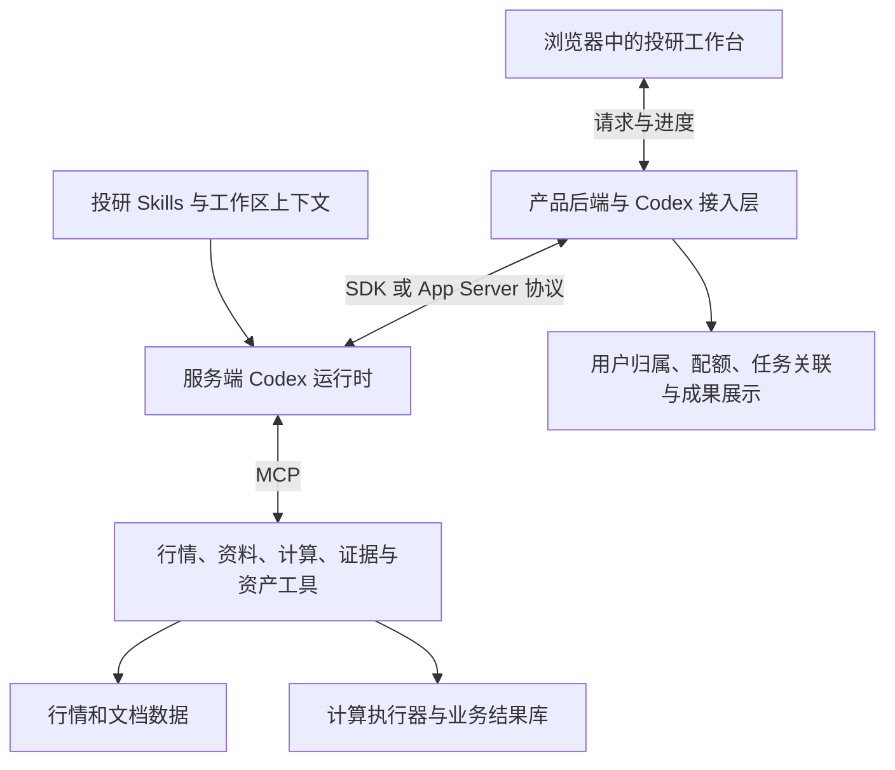

# 投研 Web 助手目标架构：Codex 内核

2026-10-03 更新：用户采纳以研究项目为中心的产品改进，研究中心第一阶段已交付项目、公司关联、跨对话成果和带历史版本的研究笔记。继续沿用本文的唯一 Codex 内核、MCP 业务边界与本地计算基础；实施、验收和剩余阶段见 [研究项目工作台实施](research-project-implementation.md)。

2026-09-30 更新：开放研究工作区已接入原生文件/终端/Python、持久研究文件、试算修复与同回合运行结果读取，详见 [Codex 研究工作区](codex-research-workspace.md)。下文中尚未实现的全量旧模型路径退役和多用户运营能力仍是目标，不能视为已交付。

日期：2026-09-29。状态：目标架构；Codex 回合、MCP 工具和结构化业务动作已实现，Web 在 runtime 就绪后自动选择 Codex，完整真实模型验收和多用户 Web 运营能力仍待完成。本文件沿用原路径，集中替代此前的演进建议，避免继续增加相互冲突的方案。

用户已明确：服务对象没有 Codex，通过 Web 使用产品；希望充分利用 Codex 的能力，避免自建 Agent 和渐进堆叠带来的长期投入。基于这些约束，推荐 **自有投研 Web 界面 + 服务端 Codex App Server + 投研 Skills / MCP 工具**。Python SDK 是可选的后端接入便利层，Codex 是唯一的研究 Agent 内核。

## 1. 产品入口的选择

| 选择 | 与目标用户的匹配 | 工程影响 |
| --- | --- | --- |
| 自有投研 Web 界面，后端使用 Codex | 用户只需浏览器和本产品账号，可直接使用股票列表、K 线、证据阅读和观察池 | 自建投研界面及服务接入，复用 Codex 的 Agent 机制；推荐 |
| 直接让用户使用 Codex 客户端 | 适合已有 Codex、愿意使用通用工作区的研究者 | 可减少自建界面，但与当前无 Codex 用户的服务方式不匹配 |

官方提供 App Server 供产品构建自定义客户端，涵盖认证、会话历史、审批和事件流。SDK / App Server 接入的是运行时与协议；它们不自动提供已经集成股票图表、研究资料和观察池的投研 Web 页面。

前端借鉴 Codex 的连续对话、过程反馈、中途补充和成果查看方式。用户看到的概念是研究、股票、资料、方案、证据与结果。后台使用哪种运行时属于实现细节。

## 2. 一套目标架构

职责保持清晰：

| 部分 | 负责什么 | 实现边界 |
| --- | --- | --- |
| Codex 运行时 | 理解目标、选择步骤、调用工具、编写程序、接收错误并继续工作、维护会话上下文 | 使用官方原生能力，不再自建 planner、工具循环和通用 Agent 状态机 |
| 投研 Skills | 研究方法、何时澄清、计算与证据检查、成果标准 | 指导 Codex 使用工具；不能替代服务端数据约束 |
| MCP 工具与业务服务 | 数据发现、范围内读取、程序验证、批量计算、引用核验、结果提交与资产管理 | 操作可验证、可计量，写入有版本和幂等约束 |
| 产品后端 | 用户与研究归属、运行时连接、进度转发、任务关联、配额、文件与成果访问 | 是应用服务和协议适配，不另建智能规划层 |
| Web 界面 | 对话、进度、必要选择、表格、图表、原文与研究成果 | 根据事件和结构化成果展示，不解析回复文本来猜测业务动作 |

会话内容和工作回合以 Codex thread / turn 为准；产品数据库保存用户归属、thread 关联、方案版本、筛选批次、逐股判断和观察记录。允许为界面建立可重建的索引缓存，避免两套可独立修改的会话事实源。

Codex 的回合结束不等于所有后台计算已经结束。应用关联实际计算任务状态，处理取消、断线重连和重复请求；这一部分是业务可靠性职责。

## 3. 充分利用 Codex，而保持投研体验简单

目标能力统一设计进产品：

- 用户交代研究目标，Codex 读取工作区和可用资料，提出必要澄清并持续推进已授权工作。
- 用户在执行中追加要求，接入原生中途补充能力；服务端检查任务修订，避免旧结果覆盖新要求。
- 会话、工作文件和研究成果持久保存，可继续、恢复或建立研究分支。
- 数值研究使用普通 Python，Codex 编写和修复程序；专门的执行工具提供固定数据范围、资源限制和结果验证。
- 研报、资讯和图表作为研究上下文；通过有来源定位的工具返回资料，不把整库内容反复放入提示词。
- 筛选、事件核验、候选比较和研究成果整理形成少量职责明确的 Skills。用法和工具能力按需载入。
- 文件、表格和图表作为真正的成果保存，Web 通过产物引用显示；页面按钮调用业务服务，不依赖模型回复格式。
- 新增研究方法优先扩充技能或工具，避免每种分析都增加一套 Agent、页面流程和数据库状态机。

能力选择以研究场景中的实际收益为依据。并发分析、复杂插件和额外评审应当有明确质量或耗时收益，再纳入产品；不把开启所有能力当成效果最好的证明。

模型选择以代表性真实任务的正确性和完成质量为首要依据，再比较耗时和成本。当前配置的模型不应被当成新架构的能力上限；具体更换需要实测结果，不在本文承诺某个模型必然更优。

## 4. Web 工作台应当长什么样

核心工作台采用三块联动区域：

| 区域 | 用户看到的内容 |
| --- | --- |
| 研究列表 | 正在进行和已完成的研究、保存方案、最近成果 |
| 对话与工作进度 | 用户要求、必要澄清、实际处理进展、中途补充、停止和继续 |
| 研究材料与成果 | 股票结果、K 线、条件差异、原文证据、候选比较、研究笔记和观察记录 |

资料库作为选取材料和查看原文的入口，可以把当前股票、文档或图表附加到同一研究中。用户不需要在几个库之间分别完成对话，再手动拼接结论。

保留已经有效的 K 线、PDF 阅读、列表和观察组件。助手工作台按新会话与事件合同重新组织，现有页面结构和六个菜单不作为不可改变的设计前提。

示例需求：

> 帮我从全部 A 股中找最近走势向上、同时有扩产落地消息的股票。核对必要口径后筛选，列出依据和数据不足原因，保存方案。

助手应核对最新可用日期和资料覆盖，对周期、计算方法和事件时间范围等实质歧义提出具体问题；随后完成计算验证、筛选、原文查证和结果交付。用户能看到真实进度，并从结果直接打开股票图表与引用原文。

用户继续说“把第一个条件改成 30 日，再跑一次”，系统展示差异，建立新的方案修订和运行。原结果依然对应原日期与原条件。

## 5. 现有实现的保留和退役

本次检查发现，Agent 逻辑不只在对话层。资料分析也有自建工具循环，部分形态、条件和报告目录功能直接调用模型。接入 Codex 时需要一起梳理，避免表面换入口、后台仍保留多套智能执行路径。

| 现有部分 | 目标处理 |
| --- | --- |
| `market.py`、`documents.py`、`evidence_sources.py`、`news_library.py` 等数据能力 | 复用经过验证的读写、索引与来源定位能力，整理为领域服务和 MCP 工具 |
| `runtime_executor.py`、数值计算、结果校验、运行快照及观察记录 | 复用有效算法和业务合同，按新工具边界重组 |
| 旧对话 planner 与工具循环 | 已从生产入口和测试中移除；Codex Runtime + MCP 是唯一对话执行路径 |
| `evidence_analysis.py` 的模型工具循环 | 语义阅读与判断交给 Codex；原文是否存在、日期/证券范围及覆盖检查提取为确定性校验 |
| `condition_language.py`、`pattern_language.py`、`report_catalog.py` 等直接模型调用 | 各自的语言理解任务归入 Codex 工作流，提取并保留数据转换及验证能力 |
| `model_client.py` 与旧模型回合协议 | 不再服务对话选股 Agent；其他资料库的独立模型能力待后续按 Skills/MCP 迁移 |
| 会话工作台与产品页面 | 复用显示组件，按 Codex 事件和结构化业务成果重建助手主流程 |
| 历史资产与结果 | 通过明确转换或只读历史视图保存价值；历史读取不再依赖旧 Agent 运行 |

最终生产系统只有一条研究 Agent 路径。兼容历史数据可以保留小型读取或转换模块，不长期保留一个能独立执行研究的旧系统。

## 6. 接入方式与 Web 服务边界

App Server 是产品集成的核心接口。官方 Python SDK 通过 JSON-RPC 控制本地 App Server，具有固定运行时依赖；项目现有 Python 3.12 符合官方列出的语言版本要求。采用 SDK 还是直接协议取决于所需事件、会话和交互接口在固定版本中的实际覆盖，业务代码只依赖一个内部接入模块。

Codex 进程部署在服务端，浏览器只访问产品后端。内部优先采用官方默认 stdio 连接；产品可以通过自己的 SSE 或 WebSocket 向浏览器推送事件，不需要把实验性的 App Server WebSocket listener 暴露给用户。自定义投研工具优先采用 MCP；动态工具接口当前标为实验能力，使用前独立验证。

用户可以只注册本产品账号，由服务端管理模型认证和费用。程序化调用优先评估官方 API 认证方式；已有模型代理需要验证实际 Codex 请求兼容性。此处不假定每名用户拥有 Codex 账号，也不把个人订阅当作公共服务的共享配额。

Web 服务需要从一开始定义：

- 用户、会话、文件、证券池、方案、结果与工具访问的归属；客户端传来的 thread ID 必须由服务端核对。
- 有效的执行环境隔离，保证研究代码只能访问获准的数据和产物。不同工作目录本身不能证明多用户隔离。
- 单用户与全局并发、运行时间、模型调用及计算预算；长任务能取消，重复请求幂等。
- 运行时和计算 worker 的生命周期、异常退出恢复，以及浏览器断线后的继续查看。
- 服务端凭证与用户请求分离，产品只开放明确的研究能力入口。

这些是提供 Web 服务的必要应用职责。当前本地单用户实现尚未完成这些改造；修改监听地址不能作为 Web 服务交付。本方案不预先规定容器或部署供应商，隔离和运行能力需要在最终环境中验收。

## 7. 成本控制与统一切换

采用完整目标架构和一次正式切换。开发仍有依赖顺序和验证阶段，但中间步骤不变成长期共存的产品架构。

| 工作阶段 | 交付物与结束条件 |
| --- | --- |
| 架构与接口核实 | 确定唯一运行时接入、数据/产物合同、用户隔离边界和旧路径退役清单；真实验证当前供应商及核心工具往返 |
| 按目标架构构建 | 完成 Codex 接入、投研工具与 Skills、Web 工作台、资产转换和应用服务；不在旧 Agent 之上再加规划 Agent |
| 统一验收 | 按同一组真实任务验证研究质量、数值/证据、交互、取消恢复、用户隔离及资源使用；记录完成与未完成项 |
| 切换与退役 | 固定一个发布版本，校验资产转换并切换正式入口，移除旧 Agent 生产路由、重复提示词及重复模型回合逻辑 |

回滚以可恢复的发布版本和迁移方案为单位，不在新架构中永久维护两种 Agent 的运行时开关。具体资产保护与发布动作按实际环境执行；本文没有进行删除、迁移或部署。

成本规则：

1. 新增模块必须归属于运行时接入、投研业务工具、Web 展示或服务运营之一，避免额外通用 Agent 框架。
2. 工具按稳定业务能力组织，避免每种技术指标、每份研报、每个研究主题各建一套工具。
3. Skills 主要承载方法与交付标准，确定性代码只处理确有必要的计算、校验和系统集成。
4. 同一能力只有一个生产所有者；相似模块合并，过渡实现带明确退役条件。
5. 固定 SDK / App Server 版本，集中验证升级，业务和页面不散落对实验协议的直接依赖。
6. 用真实任务完成质量、人工介入、延迟、模型费用和维护范围评估投入；不承诺未经测量的降本比例。

## 8. 完整交付的验收标准

目标体验覆盖“提出需求 → 必要澄清 → 查资料/计算 → 核验 → 候选与研究成果 → 保存复用/观察”。验收必须证明：

- 连续工作可以完成真实跨库研究；用户修改条件时只改变对应口径，历史结果可核对。
- AND / OR / NOT、排名分母、截止日和缺失处理语义在整个执行过程中一致。
- 数值代码出错能被发现并在预算内修复；修复不能擅自改变条件来增加命中。
- 引用来自实际读取的原文，事实、预测、推断和证据冲突有区分；没有资料保留未知。
- 前端显示真实任务和计算状态，程序成功、回合完成及研究交付具有明确含义。
- 浏览器断线、服务异常、取消和重放不会造成重复资产、错绑结果或跨用户访问。
- 旧 Agent 已从新生产路径退出；历史数据仍可读取，新任务不再依赖旧模型循环。
- 模型与代理的实际能力、运行环境、费用和延迟有可复查的测量结果；离线测试不替代真实模型验收。

本次只更新架构与设计方向，没有安装 SDK、调用真实模型、修改业务代码或执行迁移。旧版功能的实际完成情况继续以原有验证记录为准，不能将本文作为新系统已交付的证据。

## 9. 依据

工作区依据：[原对话式筛选实施计划](对话式股票筛选实施计划_Luna6.md)、[原实施进度](对话式筛选实施进度.md)、[产品打磨记录](product-polish-2026-09-29.md)、[观察池第一版](observation-pool-v1.md)，以及本次核对的模型调用、执行、资料工具和前端代码。

2026-09-29 实际读取的 OpenAI 官方文档：

- [Codex App Server](https://learn.chatgpt.com/docs/app-server)：自定义客户端、会话、事件、执行中补充和协议状态。
- [Codex SDK](https://learn.chatgpt.com/docs/codex-sdk)：Python 接入本地 App Server 与运行时依赖。
- [Model Context Protocol](https://learn.chatgpt.com/docs/extend/mcp)：本地与远程业务工具接入。
- [Build skills](https://learn.chatgpt.com/docs/build-skills)：按需加载的方法、资源和脚本。
- [Authentication](https://learn.chatgpt.com/docs/auth)：程序化调用与模型认证。
- [Advanced Configuration](https://learn.chatgpt.com/docs/config-file/config-advanced#custom-model-providers)：代理及自定义模型供应商配置。
